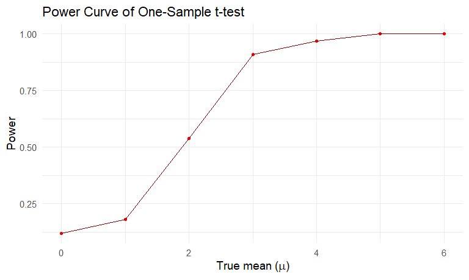
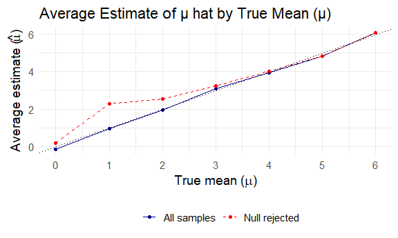
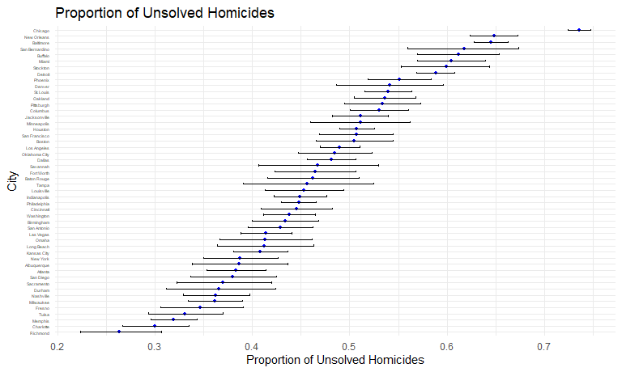

p8105_hw5_nnk2114
================

## Problem 1

``` r
bday_sim = function(n_room) {
  birthdays = sample (1:365, n_room, replace = TRUE)
  repeated_bday = length(unique(birthdays)) <n_room
repeated_bday
}
```

View the results

``` r
bday_sim_results =
  expand_grid(
    bdays = 5: 50,
    iter = 1:10000
  )|>
  mutate(
    results = map_lgl(bdays, bday_sim)
  ) |>
  group_by(
    bdays
  ) |>
  summarize(
    prob_repeat= mean(results)
  )
```

Plot this

``` r
bday_sim_results |>
  ggplot(aes( x= bdays, y = prob_repeat)) +
   geom_line(color = "blue") +
   geom_hline(yintercept = 0.5, linetype = "dashed", color = "red") +
  labs(title = "Probability of Shared Birthday vs Group Size",
       x = "Group Size",
       y = "Probability of Shared Birthday") +
  theme_minimal()
```


## Problem 2

Define the function

``` r
sim_t_test = function(samp_size = 30, mu = 0, sigma = 5, alpha = 0.05){
  
  results = 
    map(1:100, ~ rnorm(n = samp_size, mean = mu, sd = sigma)) |> 
    map(~ t.test(.x, mu = 0)) |> 
    map_df(~ broom::tidy(.x)) |> 
    select(estimate, p.value) |> 
    mutate(reject_null = p.value < alpha)
  
  return(results)
}
```

Run for mu = (1,2,3,4,5,6)

``` r
t_test_results =
  expand_grid(mu = 0:6) |> 
  mutate(result = map(mu, ~ sim_t_test(mu = .x))) |> 
  unnest(cols = c(result))
```

Make the power plot

``` r
power_plot = 
t_test_results |> 
  group_by(mu) |> 
  summarize(
    proportion = mean(reject_null)
  )
```

``` r
power_plot |> 
  ggplot(aes(x = mu, y = proportion)) +
  geom_point(color = "red") +
  geom_line(color = "darkred") +
   labs(
    title = "Power Curve of One-Sample t-test",
    x = expression("True mean ("*mu*")"),
    y = "Power"
  ) +
  theme_minimal(base_size = 14)
```



When μ increases, the power of the test also increases which shows that
the probability of rejecting the null hypothesis increases for larger
effect sizes. The test is sensitive to the differences between the 0 and
the true μ, thus the test tend to rejects null hypothesis more when the
true μ increases far from 0. When μ is closer to 0, the test rarely
rejects the null hypothesis.

Compute the average

``` r
avg_estimates =
  t_test_results |>
  group_by(mu) |>
  summarize(
    mean_est_all = mean(estimate),
    mean_est_reject = mean(estimate[reject_null]),
    .groups = "drop"
  )
```

``` r
avg_estimates |>
  ggplot(aes(x = mu)) +
  geom_line(aes(y = mean_est_all, color = "All samples")) +
  geom_point(aes(y = mean_est_all, color = "All samples")) +
  geom_line(aes(y = mean_est_reject, color = "Null rejected"), linetype = "dashed") +
  geom_point(aes(y = mean_est_reject, color = "Null rejected")) +
  scale_color_manual(values = c("All samples" = "darkblue", "Null rejected" = "red")) +
   scale_x_continuous(breaks = 0:6) +
  labs(
    title = "Average Estimate of μ hat by True Mean (μ)",
    x = expression("True mean ("*mu*")"),
    y = expression("Average estimate ("*hat(mu)*")"),
    color = " "
  ) +
  theme_minimal(base_size = 14) +
  theme(legend.position = "bottom")
```



The estimated average for all samples are close to the true mean showing
that the estimator is not biased. However, the estimated mean average
for the samples with the null being rejected is higher than the true
mean at the small effect sizes. Since we tested based on the
significance, so the larger effect size often had the null rejected.

## Problem 3

``` r
hw5_homicides= 
  read_csv("homicide-data.csv") |>
  janitor::clean_names()|>
  mutate(
  city_state = 
  str_c(city, state, sep = ", ")
  )|> 
  group_by(city)|>
  summarize(
    total_homicides = n(),
    unsolved_homicides = sum(disposition %in% c("Closed without arrest", "Open/No arrest")))
```

    ## Rows: 52179 Columns: 12
    ## ── Column specification ────────────────────────────────────────────────────────
    ## Delimiter: ","
    ## chr (9): uid, victim_last, victim_first, victim_race, victim_age, victim_sex...
    ## dbl (3): reported_date, lat, lon
    ## 
    ## ℹ Use `spec()` to retrieve the full column specification for this data.
    ## ℹ Specify the column types or set `show_col_types = FALSE` to quiet this message.

``` r
hw5_homicides |>
  arrange(desc(total_homicides)) |> 
  knitr::kable()
```

| city           | total_homicides | unsolved_homicides |
|:---------------|----------------:|-------------------:|
| Chicago        |            5535 |               4073 |
| Philadelphia   |            3037 |               1360 |
| Houston        |            2942 |               1493 |
| Baltimore      |            2827 |               1825 |
| Detroit        |            2519 |               1482 |
| Los Angeles    |            2257 |               1106 |
| St. Louis      |            1677 |                905 |
| Dallas         |            1567 |                754 |
| Memphis        |            1514 |                483 |
| New Orleans    |            1434 |                930 |
| Las Vegas      |            1381 |                572 |
| Washington     |            1345 |                589 |
| Indianapolis   |            1322 |                594 |
| Kansas City    |            1190 |                486 |
| Jacksonville   |            1168 |                597 |
| Milwaukee      |            1115 |                403 |
| Columbus       |            1084 |                575 |
| Atlanta        |             973 |                373 |
| Oakland        |             947 |                508 |
| Phoenix        |             914 |                504 |
| San Antonio    |             833 |                357 |
| Birmingham     |             800 |                347 |
| Nashville      |             767 |                278 |
| Miami          |             744 |                450 |
| Cincinnati     |             694 |                309 |
| Charlotte      |             687 |                206 |
| Oklahoma City  |             672 |                326 |
| San Francisco  |             663 |                336 |
| Pittsburgh     |             631 |                337 |
| New York       |             627 |                243 |
| Boston         |             614 |                310 |
| Tulsa          |             584 |                193 |
| Louisville     |             576 |                261 |
| Fort Worth     |             549 |                255 |
| Buffalo        |             521 |                319 |
| Fresno         |             487 |                169 |
| San Diego      |             461 |                175 |
| Stockton       |             444 |                266 |
| Richmond       |             429 |                113 |
| Baton Rouge    |             424 |                196 |
| Omaha          |             409 |                169 |
| Albuquerque    |             378 |                146 |
| Long Beach     |             378 |                156 |
| Sacramento     |             376 |                139 |
| Minneapolis    |             366 |                187 |
| Denver         |             312 |                169 |
| Durham         |             276 |                101 |
| San Bernardino |             275 |                170 |
| Savannah       |             246 |                115 |
| Tampa          |             208 |                 95 |

The raw dataset contains information about murders in U.S. cities,
include 50 observations and 3 variables.

- `uid`: case ID

- `victim_last`, `victim_first`,`victim_age`, `victim_sex`,
  `victim_race`: victims’ information

- `city`, `state`: location of the muders

- `disposition`: status if the case is solved or not

Estimate the proportion of homicides that are unsolved for the city of
Baltimore, MD

``` r
hw5_homicides |>
  filter(city == "Baltimore") |>
  summarize (
    prop = list(prop.test(unsolved_homicides, total_homicides))
  )|>
  
   mutate(
     results = map(prop, broom::tidy)
     )|>
  unnest(results) |>
  select(estimate, conf.low, conf.high)|>
  knitr::kable(digits = 3)
```

| estimate | conf.low | conf.high |
|---------:|---------:|----------:|
|    0.646 |    0.628 |     0.663 |

Run the prop test for each of the cities

**Now run prop.test for each of the cities in your dataset, and extract
both the proportion of unsolved homicides and the confidence interval
for each. Do this within a “tidy” pipeline, making use of purrr::map,
purrr::map2, list columns and unnest as necessary to create a tidy
dataframe with estimated proportions and CIs for each city.**

``` r
all_city_prop=
  hw5_homicides |> 
   mutate(
     test = map2(unsolved_homicides,total_homicides, ~ prop.test(x = .x, n = .y, correct = FALSE))
    ) |> 
  mutate(tidy_test = map(test, broom::tidy)) |> 
  select(city, tidy_test) |> 
  unnest(cols = tidy_test) |> 
  select(city, estimate, conf.low, conf.high) |> 
  arrange(estimate) 
 
all_city_prop |>  knitr::kable(digits = 4)
```

| city           | estimate | conf.low | conf.high |
|:---------------|---------:|---------:|----------:|
| Richmond       |   0.2634 |   0.2240 |    0.3071 |
| Charlotte      |   0.2999 |   0.2668 |    0.3352 |
| Memphis        |   0.3190 |   0.2960 |    0.3429 |
| Tulsa          |   0.3305 |   0.2935 |    0.3696 |
| Fresno         |   0.3470 |   0.3061 |    0.3903 |
| Milwaukee      |   0.3614 |   0.3338 |    0.3901 |
| Nashville      |   0.3625 |   0.3292 |    0.3971 |
| Durham         |   0.3659 |   0.3113 |    0.4242 |
| Sacramento     |   0.3697 |   0.3224 |    0.4196 |
| San Diego      |   0.3796 |   0.3365 |    0.4247 |
| Atlanta        |   0.3834 |   0.3533 |    0.4143 |
| Albuquerque    |   0.3862 |   0.3385 |    0.4362 |
| New York       |   0.3876 |   0.3502 |    0.4263 |
| Kansas City    |   0.4084 |   0.3808 |    0.4366 |
| Long Beach     |   0.4127 |   0.3642 |    0.4630 |
| Omaha          |   0.4132 |   0.3665 |    0.4615 |
| Las Vegas      |   0.4142 |   0.3885 |    0.4404 |
| San Antonio    |   0.4286 |   0.3954 |    0.4624 |
| Birmingham     |   0.4338 |   0.3998 |    0.4683 |
| Washington     |   0.4379 |   0.4116 |    0.4646 |
| Cincinnati     |   0.4452 |   0.4087 |    0.4824 |
| Philadelphia   |   0.4478 |   0.4302 |    0.4656 |
| Indianapolis   |   0.4493 |   0.4227 |    0.4762 |
| Louisville     |   0.4531 |   0.4129 |    0.4940 |
| Tampa          |   0.4567 |   0.3904 |    0.5246 |
| Baton Rouge    |   0.4623 |   0.4154 |    0.5098 |
| Fort Worth     |   0.4645 |   0.4232 |    0.5063 |
| Savannah       |   0.4675 |   0.4061 |    0.5298 |
| Dallas         |   0.4812 |   0.4565 |    0.5059 |
| Oklahoma City  |   0.4851 |   0.4475 |    0.5229 |
| Los Angeles    |   0.4900 |   0.4694 |    0.5107 |
| Boston         |   0.5049 |   0.4654 |    0.5443 |
| San Francisco  |   0.5068 |   0.4688 |    0.5447 |
| Houston        |   0.5075 |   0.4894 |    0.5255 |
| Minneapolis    |   0.5109 |   0.4599 |    0.5618 |
| Jacksonville   |   0.5111 |   0.4825 |    0.5397 |
| Columbus       |   0.5304 |   0.5007 |    0.5600 |
| Pittsburgh     |   0.5341 |   0.4951 |    0.5727 |
| Oakland        |   0.5364 |   0.5046 |    0.5680 |
| St. Louis      |   0.5397 |   0.5157 |    0.5634 |
| Denver         |   0.5417 |   0.4862 |    0.5961 |
| Phoenix        |   0.5514 |   0.5190 |    0.5834 |
| Detroit        |   0.5883 |   0.5690 |    0.6074 |
| Stockton       |   0.5991 |   0.5529 |    0.6436 |
| Miami          |   0.6048 |   0.5693 |    0.6393 |
| Buffalo        |   0.6123 |   0.5698 |    0.6532 |
| San Bernardino |   0.6182 |   0.5595 |    0.6736 |
| Baltimore      |   0.6456 |   0.6277 |    0.6630 |
| New Orleans    |   0.6485 |   0.6235 |    0.6728 |
| Chicago        |   0.7359 |   0.7241 |    0.7473 |

Plot the proportions

``` r
all_city_prop |> 
  mutate(city = factor(city, levels = city)) |> 
  ggplot(aes(x = city, y = estimate)) +
  geom_point(color = "blue", size = 1) +
  geom_errorbar(aes(ymin = conf.low, ymax = conf.high), width = 0.3) +
  labs(
    x = "City",
    y = "Proportion of Unsolved Homicides",
    title = "Proportion of Unsolved Homicides"
  ) +  
  theme_minimal() +
  theme(
    axis.text.x = element_text(angle = 90, hjust = 1, vjust = 1)
  )
```



The graph showed the states with low proportion of unsolved cases are
Richmond and Charlotte with less than 30% cases are unsolved. The city
with the highest proportion of unsolved cases is Chicago 73%.
